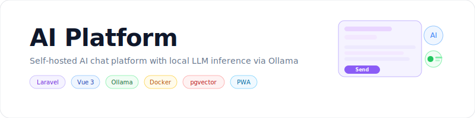

<p align="center">
    <picture>
        <source media="(prefers-color-scheme: dark)" srcset="art/banner-dark.svg">
        <source media="(prefers-color-scheme: light)" srcset="art/banner-light.svg">
        
    </picture>
</p>

<p align="center">
Self-hosted AI chat platform with local LLM inference, 13 AI providers, and 30 integrations
</p>

<p align="center">
<a href="https://github.com/jeremykenedy/ai-platform/actions/workflows/tests.yml"></a>
<a href="LICENSE"></a>
</p>

## Table of Contents

- [About](#about)
- [Features](#features)
- [Screenshots](#screenshots)
- [Tech Stack](#tech-stack)
- [Services](#services)
- [Prerequisites](#prerequisites)
- [Installation](#installation)
- [Quick Start: Local Development](#quick-start-local-development)
- [Quick Start: QNAP Deployment](#quick-start-qnap-deployment)
- [Environment Variables](#environment-variables)
- [Architecture](#architecture)
- [Make Targets](#make-targets)
- [Artisan Commands](#artisan-commands)
- [API Endpoints](#api-endpoints)
- [AI Providers](#ai-providers)
- [Integrations](#integrations)
- [Keyboard Shortcuts](#keyboard-shortcuts)
- [Contributing](#contributing)
- [License](#license)

## About

A self-hosted AI chat platform that runs entirely on a QNAP NAS (or any Docker host) via Docker Compose. It combines a Laravel 13 API backend, a compiled Vue 3 SPA frontend, and a local LLM inference stack powered by Ollama. The interface is modeled after Claude.ai in look, feel, and interaction patterns.

The platform supports 13 AI providers (local and commercial), 30 third-party integrations, persistent memory across conversations, real-time streaming via WebSockets, file analysis, image generation, voice input/output, and a full admin dashboard.

## Features

- Chat UI modeled after Claude.ai with virtual scrolling and real-time streaming
- Local LLM inference via Ollama with Intel GPU acceleration
- 13 AI providers: Ollama, Anthropic, OpenAI, Google Gemini, Mistral, Groq, Together AI, OpenRouter, Replicate, Stability AI, ElevenLabs, Deepgram, ComfyUI
- Auto-routing selects the best model per message (vision, code, reasoning, speed)
- Persistent memory system with pgvector similarity search and importance decay
- Conversation summarization to manage context window limits
- 30 third-party integrations (Google Calendar, Gmail, GitHub, Slack, Notion, Spotify, and more)
- File analysis: PDF, DOCX, XLSX, CSV, code files, images
- Image generation via ComfyUI (local), Replicate, Stability AI, OpenAI DALL-E
- Voice input (speech-to-text via Whisper) and voice output (text-to-speech via ElevenLabs)
- Custom personas with configurable system prompts and model parameters
- Project-based conversation organization
- Model fine-tuning pipeline via Axolotl
- Dark mode with system preference detection
- PWA with offline support and background sync
- Invite-only registration with role-based access control
- Keyboard shortcuts and command palette (Cmd+K)
- Admin dashboard with user management, model management, and training jobs
- Real-time updates via Laravel Reverb WebSockets
- Queue processing via Laravel Horizon
- Error tracking via GlitchTip (self-hosted Sentry)
- S3-compatible object storage via MinIO
- Self-hosted search via SearXNG
- Automatic container updates via Watchtower

## Screenshots

Screenshots will be added after the UI is finalized.

## Tech Stack

| Layer | Technology | Version |
|---|---|---|
| Backend Framework | Laravel | 13 |
| PHP Runtime | FrankenPHP | latest |
| Frontend Framework | Vue 3 (Composition API) | 3.x |
| Build Tool | Vite | 6.x |
| CSS Framework | Tailwind CSS | 4.x |
| UI Components | shadcn-vue + Radix Vue | latest |
| Database | PostgreSQL + pgvector | 16 |
| Connection Pool | PgBouncer | latest |
| Cache, Queue | Redis | 7 |
| Queue Dashboard | Laravel Horizon | 5.x |
| WebSockets | Laravel Reverb | 1.x |
| LLM Inference | Ollama | latest |
| LLM UI | Open WebUI | latest |
| Image Generation | ComfyUI | latest |
| Fine-Tuning | Axolotl | latest |
| Object Storage | MinIO | latest |
| Search Engine | SearXNG | latest |
| Error Tracking | GlitchTip | latest |
| Container Updates | Watchtower | latest |
| Static Analysis | PHPStan + Larastan | Level 8 |
| PHP Formatting | Laravel Pint | latest |
| JS Linting | ESLint + Prettier + Stylelint | latest |

## Services

| Service | Purpose | Internal Port |
|---|---|---|
| frankenphp | PHP application server | 80, 443 |
| horizon | Queue worker dashboard | (via frankenphp) |
| reverb | WebSocket server | 8080 |
| frontend | Vue SPA static files | 80 |
| postgres | Primary database with pgvector | 5432 |
| pgbouncer | Connection pooling | 6432 |
| redis | Cache, queue, sessions | 6379 |
| minio | S3-compatible object storage | 9000, 9001 |
| ollama | Local LLM inference | 11434 |
| open-webui | LLM management UI | 8080 |
| comfyui | Local image generation | 8188 |
| axolotl | Model fine-tuning | (batch) |
| glitchtip | Error tracking | 8000 |
| searxng | Self-hosted search | 8080 |
| watchtower | Container auto-updates | (daemon) |

PostgreSQL, PgBouncer, and Redis are internal-only, never exposed to the host in production.

## Prerequisites

- Docker and Docker Compose v2
- Git

For local development without Docker:

- PHP 8.3+ with pdo_pgsql, redis, pcntl, intl, zip, bcmath, gd extensions
- Composer 2.x
- Node.js 20+
- npm 10+

## Installation

```bash
git clone <repo-url> ai-platform
cd ai-platform
cp .env.example .env
```

Edit `.env` with your values. At minimum, set `DB_PASSWORD`, `MINIO_ROOT_USER`, `MINIO_ROOT_PASSWORD`, and `SUPER_ADMIN_*` variables.

## Quick Start: Local Development

### With Docker

```bash
make build
make up
make migrate
make seed
```

The application is available at `http://localhost` (or the port configured in `.env`).

### Without Docker (Laravel Herd)

```bash
# Backend
cd backend
composer install
php artisan migrate --seed

# Frontend (separate terminal)
cd frontend
npm install
npm run dev
```

The application is available at `https://ai-platform.test` via Herd.

### First Login

The super admin account is created from `.env` variables during seeding:

```env
SUPER_ADMIN_NAME=Admin
SUPER_ADMIN_EMAIL=admin@example.com
SUPER_ADMIN_PASSWORD=your-secure-password
```

## Quick Start: QNAP Deployment

```bash
# SSH to QNAP
ssh $QNAP_USER@$QNAP_HOST

# Navigate to project
cd $QNAP_PROJECT_PATH

# Create environment file
cp .env.example .env
# Edit .env with production values (QNAP_HOST, QNAP_USER, QNAP_PROJECT_PATH, QNAP_DOCKER_BINARY)

# Build and deploy
make build
make up
make migrate
make seed
```

The Docker binary path on QNAP is configured via the `QNAP_DOCKER_BINARY` variable in `.env` and auto-detected by the Makefile.

Subsequent deployments:

```bash
make deploy-qnap
```

Or via the deploy script directly:

```bash
./deploy.sh qnap
```

## Environment Variables

All configuration is driven by environment variables. See [.env.example](.env.example) for the complete list.

| Group | Variables |
|---|---|
| Core Application | `APP_NAME`, `APP_ENV`, `APP_KEY`, `APP_DEBUG`, `APP_URL`, `APP_TIMEZONE` |
| Ports | `APP_HTTP_PORT`, `APP_HTTPS_PORT`, `REVERB_EXTERNAL_PORT`, `OPENWEBUI_PORT`, `GLITCHTIP_PORT`, `MINIO_*_PORT`, `SEARXNG_PORT`, `OLLAMA_PORT`, `COMFYUI_PORT` |
| Database | `DB_CONNECTION`, `DB_HOST`, `DB_PORT`, `DB_DATABASE`, `DB_USERNAME`, `DB_PASSWORD` |
| Redis | `REDIS_HOST`, `REDIS_PORT`, `REDIS_PASSWORD` |
| Session/Cache/Queue | `SESSION_DRIVER`, `CACHE_STORE`, `QUEUE_CONNECTION` |
| Sanctum | `SANCTUM_STATEFUL_DOMAINS`, `SESSION_DOMAIN` |
| Broadcasting | `REVERB_APP_ID`, `REVERB_APP_KEY`, `REVERB_APP_SECRET`, `REVERB_HOST`, `REVERB_PORT` |
| MinIO (S3) | `MINIO_ROOT_USER`, `MINIO_ROOT_PASSWORD`, `AWS_*` |
| AI Providers | `ANTHROPIC_API_KEY`, `OPENAI_API_KEY`, `GOOGLE_GEMINI_API_KEY`, `MISTRAL_API_KEY`, `GROQ_API_KEY`, `TOGETHER_API_KEY`, `OPENROUTER_API_KEY`, `REPLICATE_API_TOKEN`, `STABILITY_API_KEY`, `ELEVENLABS_API_KEY`, `DEEPGRAM_API_KEY` |
| Ollama | `OLLAMA_HOST`, `OLLAMA_PORT`, `OLLAMA_NUM_THREAD`, `OLLAMA_INTEL_GPU` |
| Model Routing | `DEFAULT_LOCAL_MODEL`, `DEFAULT_EMBEDDING_MODEL`, `DEFAULT_VISION_MODEL`, `DEFAULT_CODE_MODEL`, `MODEL_AUTO_ROUTING`, `PREFER_LOCAL_MODELS` |
| Integrations | OAuth credentials and API keys for 30 integrations |
| Monitoring | `SENTRY_LARAVEL_DSN`, `GLITCHTIP_SECRET_KEY` |
| QNAP | `QNAP_HOST`, `QNAP_USER`, `QNAP_PROJECT_PATH` |

## Architecture

```
ai-platform/
  backend/                 Laravel 13 API (FrankenPHP)
    app/
      Actions/             Single-responsibility business logic (16)
      Console/Commands/    Artisan commands (13)
      Enums/               PHP 8.4 backed enums (15)
      Events/              Broadcast events (9)
      Http/
        Controllers/       Versioned API controllers (12)
        Requests/          Form request validation (21)
        Resources/         API resource transformers (17)
      Jobs/                Queue jobs (9)
      Listeners/           Event listeners (5)
      Models/              Eloquent models (19)
      Policies/            Authorization policies (9)
      Services/
        AI/Providers/      13 AI provider implementations
        Integrations/      30 third-party integrations
        Media/             File extraction, image gen, audio
        Memory/            Extraction, retrieval, decay, summarization
    database/
      migrations/          26 migrations
      seeders/             5 seeders

  frontend/                Vue 3 SPA (Nginx)
    src/
      components/          38 Vue components
      composables/         11 composables
      stores/              10 Pinia stores
      services/            API, Echo, streaming
      workers/             Markdown, search (Web Workers)
      pages/               15 page components
      router/              Lazy routes with auth guards

  docker/                  Service configurations
  docker-compose.yml       Production (15 services)
  docker-compose.override.yml  Development overrides
  Makefile                 Operational targets
  deploy.sh               Deployment script
```

## Make Targets

| Target | Description |
|---|---|
| `make up` | Start all containers in detached mode |
| `make down` | Stop all containers |
| `make build` | Build all container images |
| `make fresh` | Drop all tables, re-migrate, and seed |
| `make migrate` | Run database migrations |
| `make seed` | Run database seeders |
| `make shell` | Open a shell in the FrankenPHP container |
| `make tinker` | Open Laravel Tinker REPL |
| `make logs` | Tail all container logs |
| `make lint` | Run all linters (Pint, PHPStan, ESLint, Prettier, Stylelint) |
| `make test` | Run backend test suite |
| `make deploy-local` | Deploy locally via deploy script |
| `make deploy-qnap` | Deploy to QNAP via deploy script |
| `make ssh-qnap` | SSH into the QNAP NAS |

## Artisan Commands

### Model Management

| Command | Description |
|---|---|
| `models:sync` | Sync available models from all configured providers |
| `models:pull {model}` | Pull a model via Ollama with progress output |
| `models:delete {model}` | Delete a model from Ollama |
| `models:list` | List all registered models with capabilities |
| `models:running` | Show currently loaded Ollama models with memory usage |

### Integration Management

| Command | Description |
|---|---|
| `integrations:list` | List all integration definitions with connected user counts |
| `integrations:seed` | Seed integration definitions table |
| `integrations:test {user} {integration}` | Test a user's integration connection |
| `integrations:clear-expired-tokens` | Clear or refresh expired OAuth tokens |

### Admin

| Command | Description |
|---|---|
| `app:seed-super-admin` | Create super admin from .env variables (idempotent) |

### Maintenance

| Command | Description |
|---|---|
| `memory:decay` | Decay importance of unaccessed memories (scheduled daily 3am) |
| `activity:prune` | Remove old activity log entries (scheduled weekly Sundays 2am) |
| `files:cleanup` | Remove orphaned files from storage |

## API Endpoints

All endpoints are under `/api/v1/`. Authentication via Sanctum cookie-based SPA auth.

### Auth

```
POST   /api/v1/auth/login
POST   /api/v1/auth/logout
POST   /api/v1/auth/register
GET    /api/v1/auth/user
POST   /api/v1/auth/password/forgot
POST   /api/v1/auth/password/reset
GET    /api/v1/auth/email/verify/{id}/{hash}
POST   /api/v1/auth/email/verify/resend
```

### Conversations and Messages

```
GET    /api/v1/conversations
POST   /api/v1/conversations
GET    /api/v1/conversations/{id}
PUT    /api/v1/conversations/{id}
DELETE /api/v1/conversations/{id}
GET    /api/v1/conversations/{id}/export
GET    /api/v1/conversations/{id}/messages
POST   /api/v1/conversations/{id}/messages
DELETE /api/v1/conversations/{id}/messages/{messageId}
POST   /api/v1/conversations/{id}/messages/{messageId}/regenerate
```

### Models

```
GET    /api/v1/models
GET    /api/v1/models/{id}
POST   /api/v1/models/pull
DELETE /api/v1/models/{id}
GET    /api/v1/models/running
```

### Personas, Projects

```
GET|POST          /api/v1/personas
GET|PUT|DELETE    /api/v1/personas/{id}
GET|POST          /api/v1/projects
GET|PUT|DELETE    /api/v1/projects/{id}
```

### Training

```
GET    /api/v1/training/datasets
POST   /api/v1/training/datasets
DELETE /api/v1/training/datasets/{id}
GET    /api/v1/training/jobs
POST   /api/v1/training/jobs
GET    /api/v1/training/jobs/{id}
POST   /api/v1/training/jobs/{id}/cancel
```

### Integrations

```
GET    /api/v1/integrations
POST   /api/v1/integrations/connect
DELETE /api/v1/integrations/{name}/disconnect
GET    /api/v1/integrations/{provider}/callback
POST   /api/v1/integrations/tools/execute
```

### Settings and Memory

```
GET    /api/v1/settings
PUT    /api/v1/settings
GET    /api/v1/settings/memories
POST   /api/v1/settings/memories
PUT    /api/v1/settings/memories/{id}
DELETE /api/v1/settings/memories/{id}
POST   /api/v1/settings/memories/bulk-delete
POST   /api/v1/settings/memories/conflicts/{id}/resolve
```

### Admin

```
GET    /api/v1/admin/users
PUT    /api/v1/admin/users/{id}
POST   /api/v1/admin/users/invite
GET    /api/v1/admin/dashboard
```

### Health

```
GET    /api/health
```

## AI Providers

| Provider | Type | Models | Capabilities |
|---|---|---|---|
| Ollama | Local | llama3.2, qwen2.5, mistral, nomic-embed-text, and more | Chat, streaming, code, embeddings |
| Anthropic | Remote | Claude Opus 4.5, Sonnet 4.5, Haiku 4.5 | Chat, streaming, vision, code, reasoning |
| OpenAI | Remote | GPT-4o, GPT-4o mini, o1, DALL-E 3, Whisper, TTS | All capabilities |
| Google Gemini | Remote | Gemini 2.0 Flash, Gemini 2.0 Pro | Chat, streaming, vision, code, reasoning |
| Mistral | Remote | Mistral Large, Codestral | Chat, streaming, code, embeddings |
| Groq | Remote | Llama 3.3 70B, Whisper | Chat, streaming (ultra-fast) |
| Together AI | Remote | 100+ open source models | Chat, streaming, vision, embeddings |
| OpenRouter | Remote | 200+ models (universal fallback) | All capabilities |
| Replicate | Remote | FLUX, SDXL | Image generation |
| Stability AI | Remote | Stable Diffusion 3.5, Stable Image | Image generation |
| ElevenLabs | Remote | Multilingual V2, Turbo V2.5 | Text-to-speech |
| Deepgram | Remote | Nova 3, Nova 2 | Speech-to-text |
| ComfyUI | Local | FLUX, DreamShaper, RealVisXL | Image generation |

All remote providers are optional. The platform works fully with local Ollama models only. Remote providers activate when their API key is present in `.env`.

## Integrations

| Category | Integrations |
|---|---|
| Productivity | Google Calendar, Gmail, Google Drive, Slack, Apple Notes, iMessages, Calendly, Notion, Microsoft Calendar |
| Developer | GitHub, GitLab, Postman, Cloudflare, Jira, Linear, Vercel |
| Design | Miro, Figma |
| Finance | PayPal, Stripe |
| Search | Brave Search, SearXNG, Apify, Microsoft Learn |
| Career | Indeed, Dice, LinkedIn |
| Legal | Harvey |
| Entertainment | Spotify |
| Local | Filesystem, macOS (AppleScript) |

Each integration exposes tools that the AI can call during conversations. Users connect their own accounts with their own credentials. Credentials are encrypted at rest using AES-256.

## Keyboard Shortcuts

| Shortcut | Action |
|---|---|
| `Cmd/Ctrl + K` | Open command palette |
| `Cmd/Ctrl + N` | New conversation |
| `Cmd/Ctrl + Shift + S` | Toggle sidebar |
| `Cmd/Ctrl + /` | Show keyboard shortcut help |
| `Enter` | Send message |
| `Shift + Enter` | New line in message |
| `Escape` | Close modal, cancel stream |

## Contributing

Contributions are welcome. Ensure all linters pass before submitting:

```bash
# Backend
cd backend
vendor/bin/pint
vendor/bin/phpstan analyse --level=8

# Frontend
cd frontend
npm run lint
npm run format
npm run lint:style
```

## License

This project is open-sourced software licensed under the [MIT license](LICENSE).
